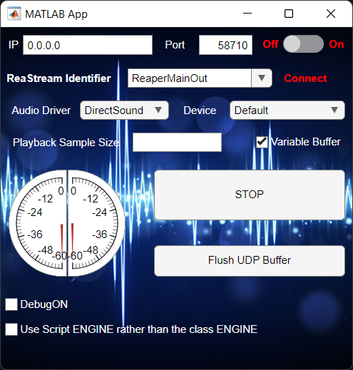

# ReaStream-Standalone-Receiver
 Application designed to recieve audio from Reastream via the UDP network protocol

App GUI interface:

Extra info:
This was originally a prototype for the mobile app reciever transmitter. 
But direct porting to android and C++ conversion didn't work so I used it for testing with the app.
There is trasmitter and reciever in the MATLAB code but only the reciever has a GUI interface.
I have not tested it with Octave but adaptation could be possible with a little effort.
